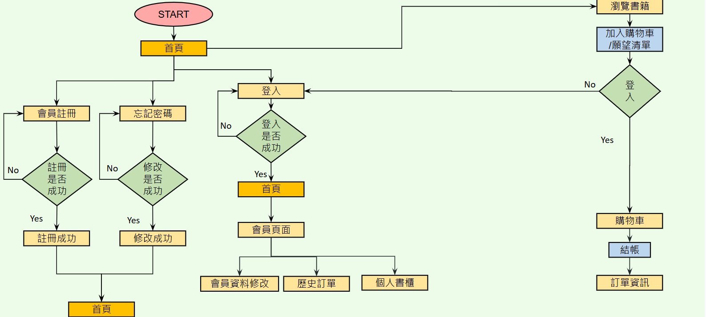

# 煞氣の書店 - 電子書城購物網站 📚

A comprehensive e-commerce platform for purchasing e-books, featuring both a user-friendly front-end and an efficient management back-end.

### 組員:
- 林靜愛
- 胡展碩
- 古兆福
- 邱奕睿
- 陳之賢

---

## 📋 目錄

1. [流程圖](#流程圖)
2. [Database Diagram](#database-diagram)
3. [Use Case Diagram](#use-case-diagram)
4. [系統開發環境及工具](#系統開發環境及工具)
5. [專案架構與使用技術](#專案架構與使用技術)
6. [前台功能介紹](#前台功能介紹)
7. [後台功能介紹](#後台功能介紹)
8. [結論](#結論)

---

## 流程圖

---

## Database Diagram

---

## Use Case Diagram

---

## 🛠 系統開發環境及工具

- **作業系統:** Windows 10
- **資料庫:** MySQL Workbench 8.0
- **程式語言:** Java JDK 17
- **開發工具:** Eclipse IDE 2024-03 (4.31.0)
- **專案管理工具:** Maven
- **框架:** Spring Boot
- **前端技術:** Bootstrap, jQuery, AJAX

---

## 🏗 專案架構與使用技術

### 1. **Maven**  
專案管理工具，簡化依賴和建置過程。

### 2. **Spring Boot**  
快速開發 Web 應用程式，具備簡潔設定與自動化功能。

### 3. **前端技術**
- **Bootstrap:** 進行響應式設計
- **jQuery & AJAX:** 處理動態交互操作

### 4. **資料庫**
實體關聯模型 (ER model) 進行資料庫設計。

---

## 🌐 前台功能介紹

### 1. **首頁**
- 瀏覽和查詢書籍分類。
- 可直接登入/註冊，點擊 LOGO 返回首頁。

### 2. **商品詳細資訊**
- 查看更多商品資訊，未登入會員將提示登入。
- 加入購物車功能，並隨機刷新首頁商品排序。

### 3. **會員登入/註冊**
- 簡單登入流程。
- 完成註冊後，系統寄送歡迎訊息。
- 忘記密碼功能，允許重新設定密碼。

### 4. **購物車**
- 顯示商品列表與活動折扣。
- 提供商品刪除功能及總價計算。
- 結帳按鈕直接跳轉至訂單頁面。

---

## 🛡 後台功能介紹

### 1. **管理者登入**
- 使用 `admin/admin` 作為預設管理帳號登入後，跳轉至管理頁面。

### 2. **會員管理**
- **新增:** 新增會員資料。
- **編輯:** 編輯會員資訊，表格會同步抓取更新資料。
- **刪除:** 刪除指定會員資料。

### 3. **書籍管理**
- **新增:** 新增書籍資料及上傳封面圖片。
- **編輯:** 編輯和修改現有書籍。
- **刪除:** 刪除書籍資料。

---

## 💡 結論

開發此購物系統的過程中，我們團隊從無到有地構建了整個系統，從規劃到實作，不僅增強了技術實力，也學到了許多寶貴經驗。儘管系統仍有改進空間，但每位組員都盡力完成了任務，並在過程中獲得了成長。特別感謝我們的導師江聖榮老師和張庭禎老師的指導。

---

